# API Data Pipeline Project (End-to-End Data Engineering Project)

## 🚀 Project Overview
This project demonstrates an **end-to-end data engineering pipeline** using Python, Pandas, Apache Spark, and SQL.

The pipeline extracts data from a public API, transforms it, processes it using Apache Spark, and performs SQL-based analysis to generate insights.

---

## 🏗️ Architecture

API → Python Extraction → Pandas Transformation → Spark Processing → SQL Analysis → Insights

---

## 🔧 Tech Stack
- Python
- Pandas
- Apache Spark (PySpark)
- SQL
- Git & GitHub
- JSONPlaceholder Public API

---

## 📥 Data Extraction
- Data is fetched from a public REST API using Python `requests`
- Raw JSON response is converted into structured tabular format

📄 File: `extract_api_data.py`

---

## 🔄 Data Transformation
- Data cleaned and transformed using Pandas
- Handled missing values and structured nested JSON
- Prepared dataset for Spark processing

📄 File: `transform_users_data.py`

---

## ⚡ Spark Processing
- Loaded structured data into Apache Spark DataFrame
- Created temporary views for SQL-based querying
- Performed distributed data processing

📄 File: `spark_user_processing.py`

---

## 📊 SQL Analysis
- Executed SQL queries on Spark temporary views
- Performed aggregations, filtering, and insights generation
- Derived meaningful patterns from user dataset

📄 File: `user_data_sql_analysis.py`

---

## 📌 Key Skills Demonstrated
- API data extraction and ingestion
- Data cleaning and transformation (Pandas)
- Big data processing (Apache Spark)
- SQL analytics on structured data
- End-to-end ETL pipeline design
- GitHub project management

---

## 📷 Screenshots

### 📥 API Extraction
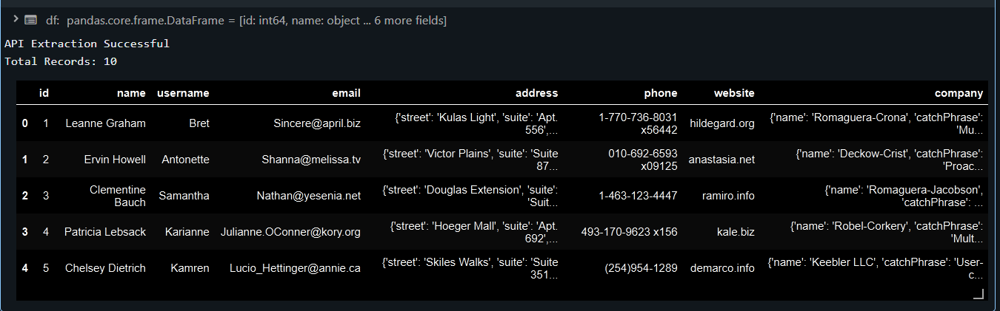

---

### 🔄 Pandas Transformation
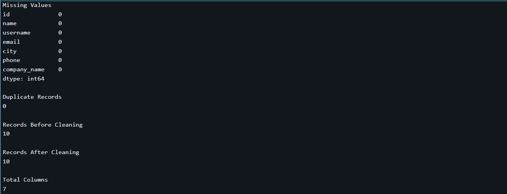
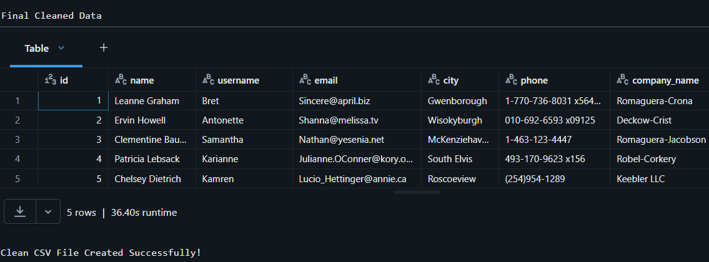

---

### ⚡ Spark Processing
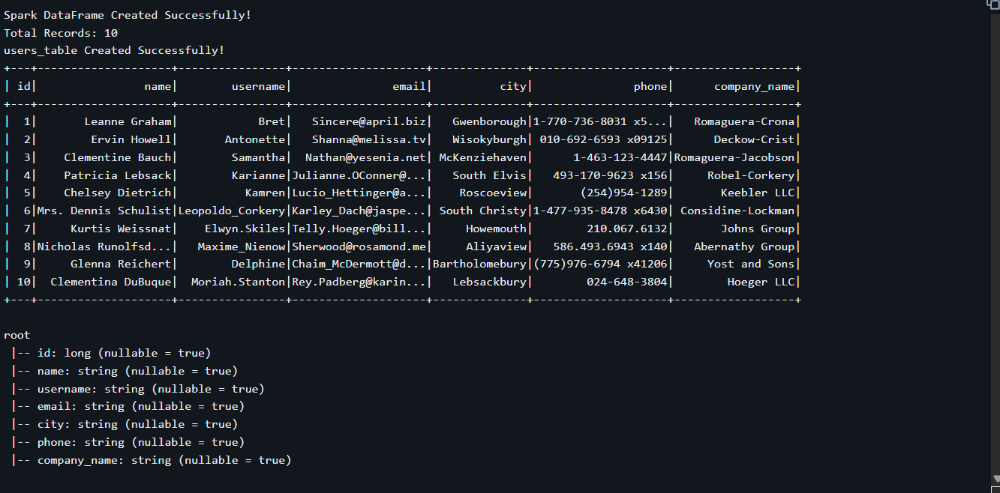
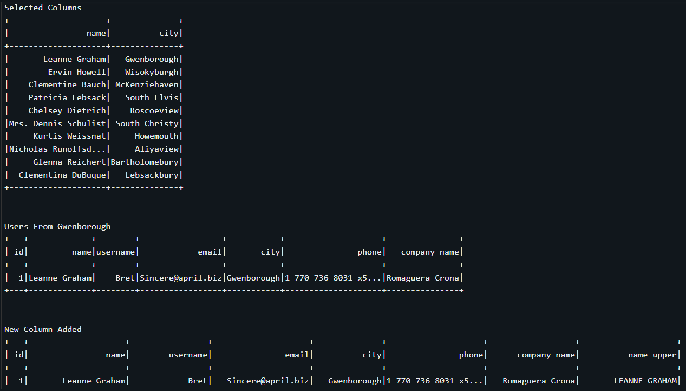
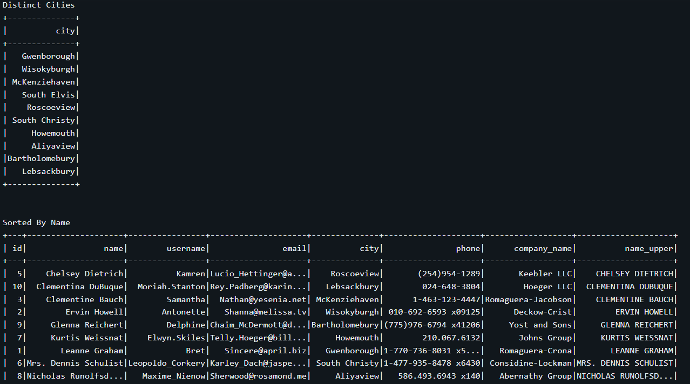
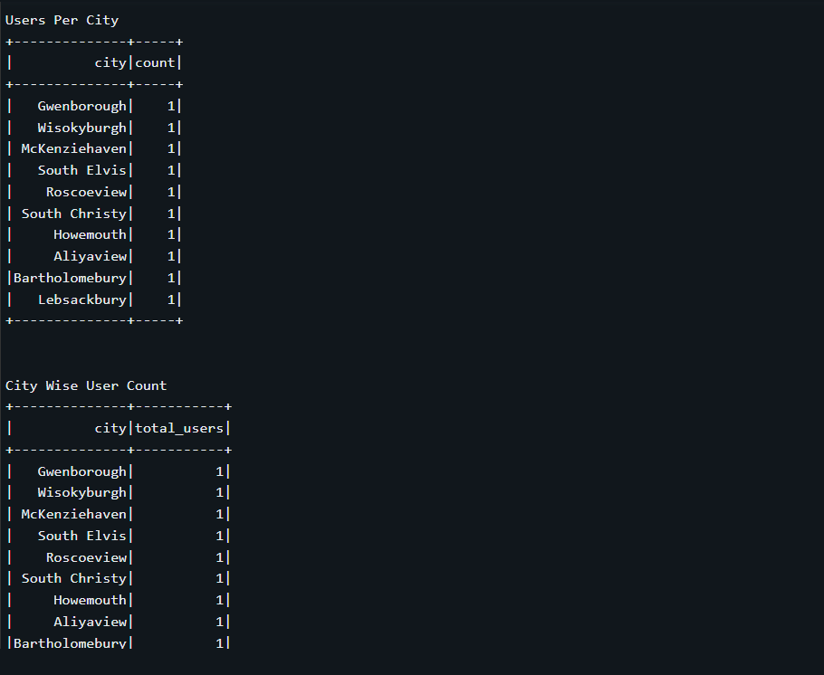

---

### 📊 SQL Analysis
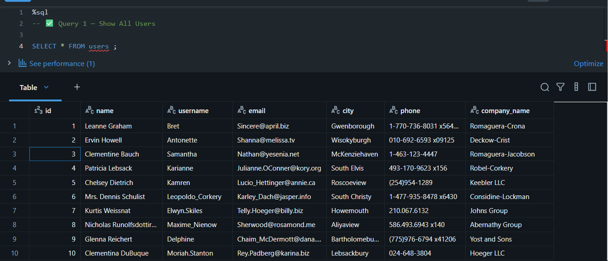
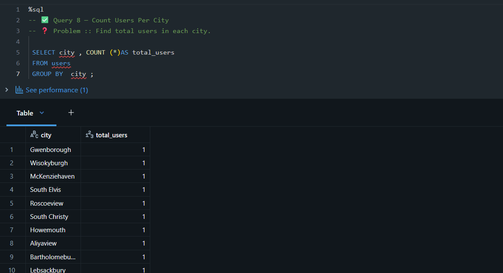
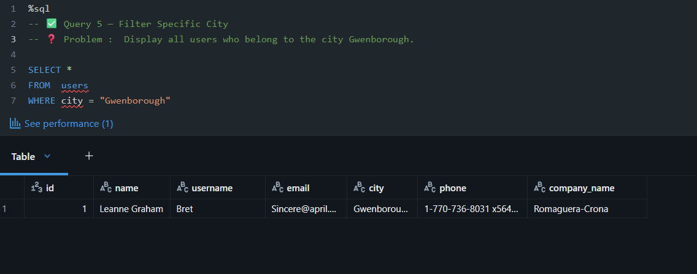
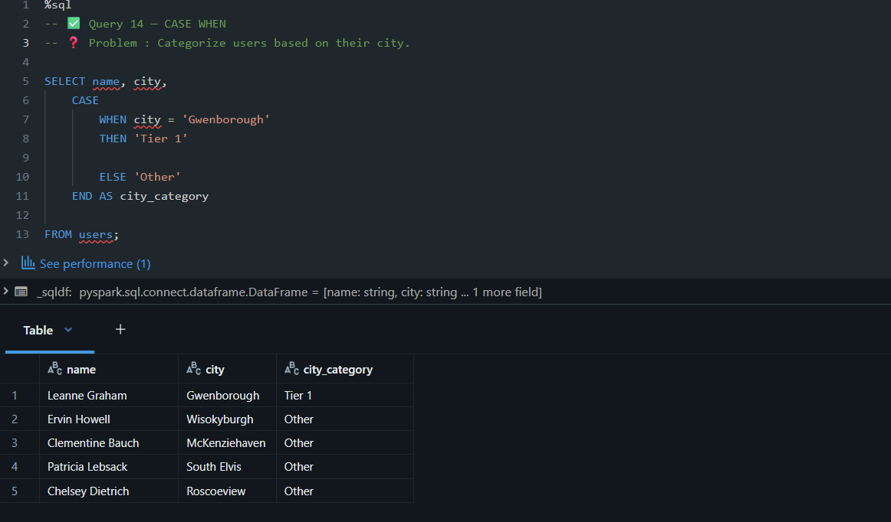
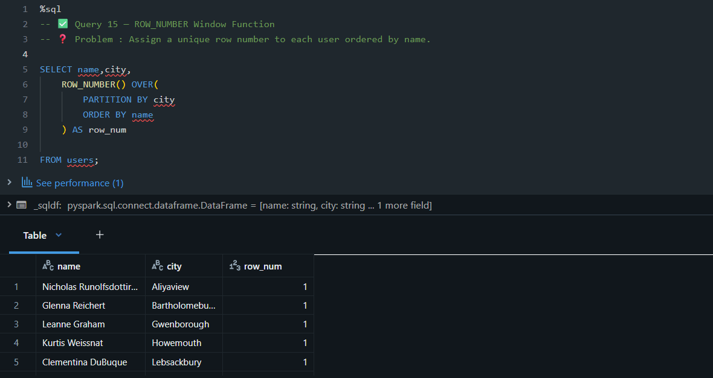

---

## 🚀 Future Enhancements
- Automate pipeline using Apache Airflow
- Deploy on AWS (S3 + Glue + Redshift)
- Add logging and monitoring
- Build interactive dashboards using Power BI / Tableau

---

## 👩‍💻 Author
**Vrushali Waghmode**  
Aspiring Data Engineer